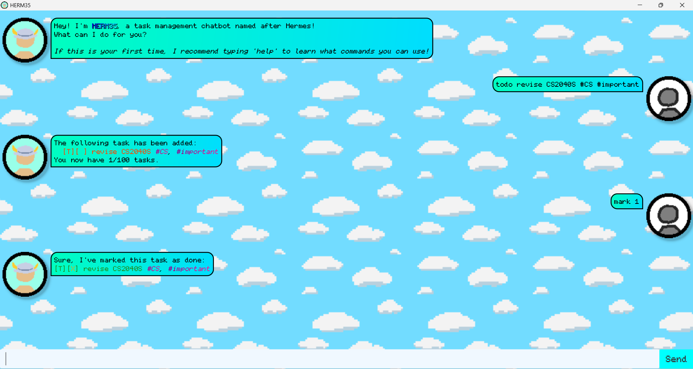

# HERM35 User Guide
***

Welcome to HERM35, the task management chatbot named after the great god Hermes! HERM35 helps you keep track of all your tasks, with an in-depth search function to assist you and a fun personality to boot!

## How to start

1. Launch HERM35 by running the provided application.
2. Start typing away! HERM35 is very intuitive to learn, and it comes with built-in instructions to guide you.

If you want to jump straight in however, below are the available commands to use:

<b> List of basic commands</b>

### :question: Getting help
- `help`: Display a list of basic commands to begin with.
- `help edit`: Display the commands related to editing task data.
- `help find`: Display the command words related to finding tasks.
- `help customisation`: Display the commands that help customise your experience.
### :heavy_plus_sign: Adding a task
- `todo TASK_NAME`: Save a task called TASK_NAME.
- `deadline TASK_NAME /by TIME`: Save a task that has to be done by TIME.
- `event TASK_NAME /from BEGIN_TIME /to END_TIME`: Save a task that starts from BEGIN_TIME and ends at END_TIME.  

You can add tags to a task using the # symbol.  
Example:  
`todo revise homework #math #important`  
saves a Task named "revise homework" tagged as "math" and "important".
### :scroll: Viewing your information
- `list`: Displays all your saved tasks.
- `tags`: Displays all your saved tags that have a task attached.
- `find KEYWORD`: Displays all your tasks that contains KEYWORD, numbered by their position in your list.

Note: The `find` command is a very powerful tool that can search with many parameters at once, do use the `help find` command to learn all of its subcommands to best utilise it.
### :pencil: Editing your information
- `mark INDEX`: Mark the task numbered INDEX as done.
- `unmark INDEX`: Mark the task numbered INDEX as not done.
- `delete INDEX`: Delete the task numbered INDEX.
- `clear`: Delete all your tasks.
- `tag INDEX #TAG`: Add the tag #TAG to the task numbered INDEX.
- `untag INDEX`: Remove all tags from the task numbered INDEX.
- `untag INDEX #TAG`: Remove the tag #TAG from the task numbered INDEX.

### :wave: Exiting the program
- `bye`: Exits the program with a nice goodbye message. (You may just click the x button on the top right however)

***There are still many more commands and features to HERM35, so do take the time to learn about them!***

<b> List of advanced commands</b>

### :mag: Searching for tasks by attribute
- `find /contains KEYWORD`: Show all tasks containing KEYWORD.
- `find /on DATE`: Show all tasks happening on DATE.
- `find /after DATE`: Show all tasks happening after DATE.
- `find /before DATE`: Show all tasks happening before DATE.
- `find /done`: Show all tasks that have been marked as done.
- `find /todo`: Show all tasks that are not marked as done.
- `find /type TASK_TYPE`: Show all tasks that are of TASK_TYPE (todo/deadline/event).
- `find /tag #TAG`: Show all tasks with tag #TAG.

You can combine different find commands together, for example:  
`find /before May 12 /after March 10 /contains sport`  
shows all tasks containing "sport" in its description, occurring before May 12 of the current year and after March 10 of the current year.

### :hammer_and_wrench: Customising your personal experience with HERM35
- `show tags`: Show the tags behind your saved tasks.
- `hide tags`: Do not show the tags behind your saved tasks.

# Main Features

## :white_check_mark: Task Management

HERM35 allows users to manage tasks using simple, keyword-based commands. The tasks are the saved to disk.

## :calendar: Flexible Date and Time Parsing

 The chatbot supports flexible date and time input formats when creating deadlines and events. Users may
 enter dates using numeric formats (e.g. 12/3/2026), month names (e.g. 31 Dec 2026), or partial dates 
 that default to the current year. Optional time information is also supported, including 24-hour time,
 HH:MM format, and AM/PM notation.  
If a given date is truly invalid, it will be saved as a simple string label.

## :handshake: Built-In Help and User Guidance

 The chatbot includes a help command that provides users with extensive guidance on available commands and their usage. If users enter malformed or incomplete commands, HERM35 responds with specific and helpful error
 messages instead of generic failures. The chatbot also utilises highlighting to improve user experience.
